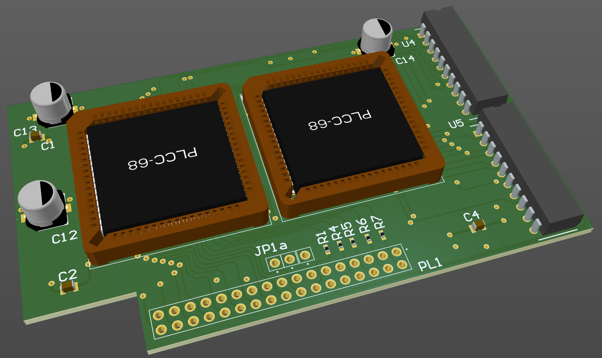

# Atomwide Twin MEMC interface recreation

April 2023

This is an essentially straight re-implementation of the Atomwide Twin MEMC board used for 8MB upgrades in various Acorn 32bit systems.
The layout and routing very closely matches the original, for purposes of understanding the original design.
Layout would/should be improved (ground planes, decent decoupling, etc) if the design was ever to be put back in to production.
Through-hole bulk caps have been replaced by SMT, otherwise all parts are as per the original design.

This has NOT been built or tested.

## Licence

No warranty is provided, and this work is used at your own risk.  

Licenced as CC BY-SA 3.0

Copyright 2023 Ian Jeffray

